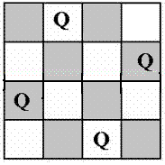

# N Queen Problem
The N Queen is the problem of placing N chess queens on an N×N chessboard so that no two queens attack each other.
For example, following is a solution for 4 Queen problem.

[Solution](./src/NQueens.java)
[Explanation of solution](https://www.youtube.com/watch?v=xouin83ebxE)